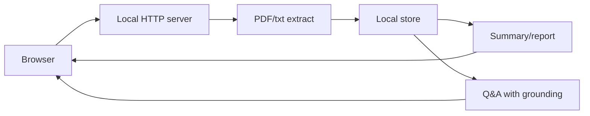

# 구현 계획 (확정안)

인터뷰 합의와 `seed.yaml`을 기준으로 한 기술·마일스톤입니다. 스택은 저장소가 비어 있어 **권장안**이며, 시작 시 한 번 확정하면 됩니다.

## 아키텍처 개요

- **형태**: 단일 로컬 프로세스가 HTTP 서버로 UI와 API를 제공.
- **흐름**: 업로드 → 텍스트 추출 → 저장 → 요약·리포트 생성 → 같은 문서 컨텍스트로 Q&A.
- **경계**: 기본은 로컬; LLM이 외부 API면 **환경 변수로만** 키 주입, 기본 UX에 “외부 호출 가능”을 명시.

## 스택 권장안

| 층 | 권장 | 이유 |
|----|------|------|
| 백엔드 | Python **FastAPI** (또는 동급) | PDF·텍스트 처리 생태계, 빠른 API 프로토타입 |
| 프론트 | **Vite + React** 또는 서버 템플릿만 | 로컬 개발자 UX, 단순 폼·채팅 UI에 충분 |
| PDF | **pymupdf** 또는 **pypdf** | 라이선스·성능 트레이드오프 후 하나로 고정 |
| 저장 | **SQLite** 또는 JSON 파일 | 세션·문서 메타 로컬 영속 |
| LLM | 환경 변수로 OpenAI 호환 API 또는 로컬 모델 | 인터뷰에서 엔진 고정 없음 |

## 마일스톤

| 주차(가이드) | 목표 | 산출 |
|--------------|------|------|
| 1 | Phase 1–2 완료 | 서버 기동, txt/pdf 추출, 로컬 저장 |
| 2 | Phase 3 완료 | 온스크린 요약·리포트 |
| 3 | Phase 4–5 완료 | 문서 근거 Q&A, 세션 UX, 스모크 문서 |

기간은 인터뷰에서 “최대한 짧게”였으므로, 위는 **압축 일정 가정**입니다.

## 위험·완화

| 위험 | 완화 |
|------|------|
| PDF 레이아웃 복잡·추출 품질 | MVP는 “텍스트 위주 PDF” 우선, 실패 시 사용자 메시지 |
| 긴 문서 토큰 한도 | 청크 + 상위 k개 검색 또는 요약 선행 |
| 외부 API 비용·지연 | 로컬 모델 옵션, 문서 크기 제한, 배치 크기 표시 |

## 다음 액션

1. 이 문서의 스택 권장안 확정 또는 대체안 기록(README 한 줄로).
2. `docs/TASKS.md` 순서대로 이슈/체크박스 진행.
3. `seed.yaml`과 수용 기준을 릴리스 전에 재대조.
